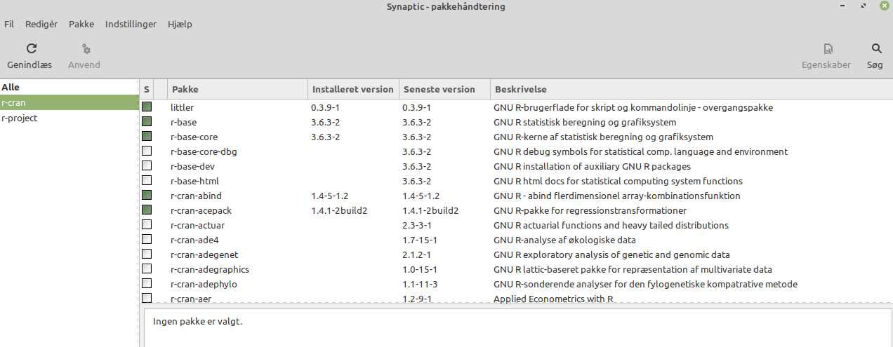
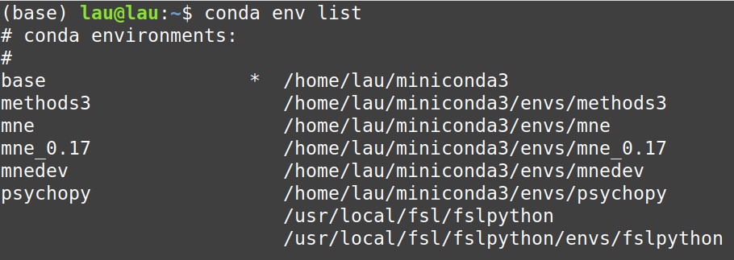
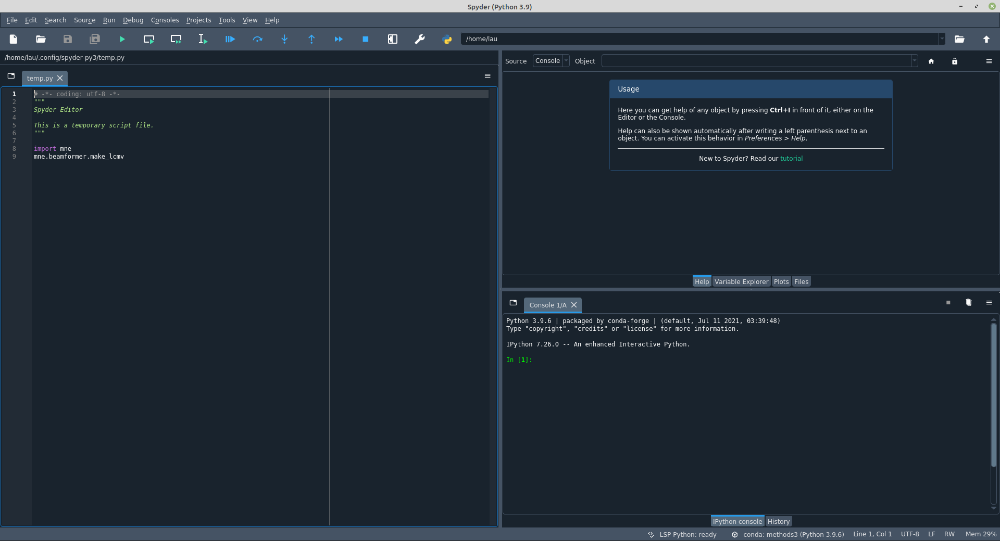

```{r setup, include=FALSE}
knitr::opts_chunk$set(echo = TRUE)
```

# Prepare your _R_ and _Python_ environments
Today's first goal is to get your _R_ and _Python_ environments up and running  

## _R_

### Mac and Windows
_R_ can be downloaded and installed from https://mirrors.dotsrc.org/cran/ (Danish mirror)  

### Linux
Can also be installed from the link above, but it is more convenient to use your package manager, e.g.


### _RStudio_ (IDE: Integrated Development Editor)

_RStudio_ can be downloaded from https://www.rstudio.com/products/rstudio/download/

### Packages

We need the package _lme4_ for specifying mixed effects models

```{r, echo=TRUE, eval=FALSE}
install.packages("lme4")
## but can also be installed from the package manager (Linux) (r-cran-lme4)
```

## _Python_

Due to the fact that _Python_ packages have a lot of interdependencies that may cause compability problems if you keep everything in one big environment, it is advisable to use a package management system like _Conda_.  
I propose using _Miniconda_ that can be downloaded from here: https://docs.conda.io/en/latest/miniconda.html (choose 64-bit)  
We'll not do much with i

An advantage is that separate environments can be maintained that are each focused on its own niche:  



Then use the yml-file from GitHub to create the appropriate environment:
```{bash, eval=FALSE}
# CODE TO BE RUN IN A BASH TERMINAL
## create environment
conda env create -f methods3_environment.yml
## activate environment
conda activate methods3
## after activation, you can run Spyder, (IDE)
spyder
```



### Check that it works

```{python}
a = 2 + 2
b = a + 3
print(b)

a_list = [1, 'a', 2.3] # square brackets initialize lists that can contain any combination of any type of object (an integer, a string and a float in this case)
## Note that Python is zero-indexed ()
print(a_list[0]) ## prints the first entry
print(a_list[1]) ## prints the second entry
```
#### zero-indexing (reference)
https://www.cs.utexas.edu/users/EWD/transcriptions/EWD08xx/EWD831.html

# Remembering the General Linear Model

## Formulae
```{r, eval=FALSE}
formula <- y ~ x ## y as a function of x
y ~ 1 ## model the intercept for "y"
y ~ x ## model the main effect of x and the intercept for y
y ~ x + 1 ## the same as above (+ 1 is implicit)
y ~ x + 0 ## model the main effect of x and no intercept
y ~ x - 1 ## the same as above
y ~ 0 ## doesn't model anything (for completeness)
y ~ x + z ## model the main effects x and z (and an intercept)
y ~ x:z ## model interaction of x and z
y ~ x * z ## model the main effects x and z and their interaction
y ~ x + z + x:z ## the same as above
```

## mtcars (data)
Let's look at the "mtcars" data set that comes:  

_[, 1]   mpg   Miles/(US) gallon  
[, 2]	 cyl	 Number of cylinders  
[, 3]	 disp	 Displacement (cu.in.)  
[, 4]	 hp	 Gross horsepower  
[, 5]	 drat	 Rear axle ratio  
[, 6]	 wt	 Weight (lb/1000)  
[, 7]	 qsec	 1/4 mile time  
[, 8]	 vs	 V/S  
[, 9]	 am	 Transmission (0 = automatic, 1 = manual)  
[,10]	 gear	 Number of forward gears  
[,11]	 carb	 Number of carburetors_  


## Miles per gallon and weight

```{r,fig.height=5, fig.width=6}
par(font.lab=2, font.axis=2, cex=1.2)
plot(mpg ~ wt, data=mtcars, xlab='Weight (lb/1000)', ylab='Miles/(US) gallon',
     main='Scatter plot', ylim=c(0, 40))
```

Let's do a linear regression

## Now let's create some models!
```{r}
linear <- lm(mpg ~ wt, data=mtcars)
quadratic <- lm(mpg ~ I(wt^2) + wt, data=mtcars)
cubic <- lm(mpg ~ I(wt^3) + I(wt^2) + wt, data=mtcars)
```

## Plotting, linear
```{r,echo=FALSE}
logLik(linear)
```
```{r, fig.height=5, fig.width=6, echo=FALSE}
par(font=2, font.lab=2, font.axis=2, lwd=3)
plot(mpg ~ wt, data=mtcars, xlab='weight (lb/1000)')
abline(linear, lty=1)
legend('topright','linear', lty=1)
```

## Plotting, quadratic
```{r,echo=FALSE}
logLik(quadratic)
```
```{r, fig.height=5, fig.width=6, echo=FALSE}
par(font=2, font.lab=2, font.axis=2, lwd=3)
plot(mpg ~ wt, data=mtcars, xlab='weight (lb/1000)')
abline(linear, lty=1)
coef.q <- coefficients(quadratic)
fit.q <- coef.q[2] * mtcars$wt^2 + coef.q[3] * mtcars$wt + coef.q[1]
lines(sort(mtcars$wt), rev(sort(fit.q)), lty=2)
legend('topright', c('linear', 'quadratic'), lty=1:2)
```

## Plotting, cubic
```{r,echo=FALSE}
logLik(cubic)
```
```{r, fig.height=5, fig.width=6, echo=FALSE}
par(font=2, font.lab=2, font.axis=2, lwd=3)
plot(mpg ~ wt, data=mtcars, xlab='weight (lb/1000)')
abline(linear, lty=1)
coef.q <- coefficients(quadratic)
fit.q <- coef.q[2] * mtcars$wt^2 + coef.q[3] * mtcars$wt + coef.q[1]
coef.c <- coefficients(cubic)
fit.c <- coef.c[2] * mtcars$wt^3 + coef.c[3] * mtcars$wt^2 + coef.c[4] * mtcars$wt + coef.c[1]
lines(sort(mtcars$wt), rev(sort(fit.q)), lty=2)
lines(sort(mtcars$wt), rev(sort(fit.c)), lty=3)
legend('topright', c('linear', 'quadratic', 'cubic'), lty=1:3)
```